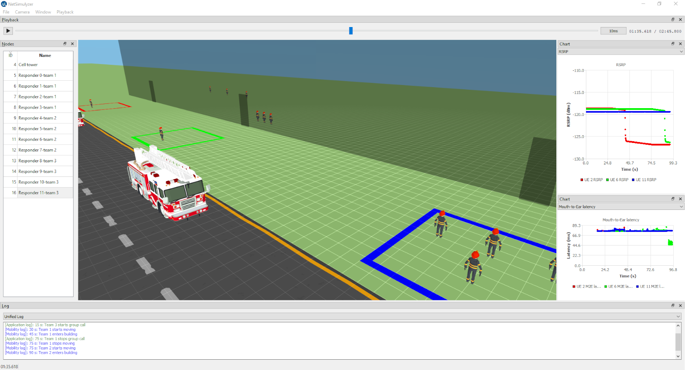

# NetSimulyzer
A flexible 3D visualizer for displaying, debugging, presenting, and understanding *ns-3* scenarios.



# Table of Contents

* [About](#about)
* [Requirements](#requirements)
* [Download Prebuilt Releases](#download-prebuilt-releases)
* [Download Pre-Run Examples](#download-pre-run-examples)
* [Resources](#resources)
  * [Supported Model Formats](#supported-model-formats)
  * [Supported Texture Formats](#supported-texture-formats)
  * [Resource Path](#resource-path)
* [Controls](#controls)
  * [Camera](#camera)
  * [Playback](#playback)
  * [Chart](#chart)
* [Building From Source](#building-from-source)
    * [Linux Packages](#linux-packages)
    * [macOS (Homebrew) Packages](#macos-homebrew-packages)
    * [Cloning](#cloning)
    * [Building](#building)
    * [CMake Options](#cmake-options)
    * [Running CMake](#running-cmake)
    * [Running](#running)
    * [Building the Documentation](#building-the-documentation)
* [Academic Attribution](#academic-attribution) 


# About
This is the application which displays *ns-3* scenarios run with
the companion *ns-3* module [found here](https://github.com/usnistgov/NetSimulyzer-ns3-module).

# Requirements

## Run Requirements
* A graphics card supporting OpenGL 3.3
  * Most integrated GPUs (i.e. Intel/AMD CPU Graphics) should work too

## Build Requirements
* A C++ 20 compliant compiler
  * Minimum supported compilers:
    * GCC 10.5.0
    * Clang 12.0.0
* CMake 3.16 or greater
* A graphics card supporting OpenGL 3.3
* Qt 6.4
* Optional: Doxygen

# Download Prebuilt Releases
Download prebuilt binaries from the [Releases](https://github.com/usnistgov/NetSimulyzer/releases)
tab on GitHub.

# Download Pre-Run Examples
Pre-run examples from the [ns-3](https://github.com/usnistgov/NetSimulyzer-ns3-module)
module may be found in the `examples/` directory of the Windows release on the
[Releases](https://github.com/usnistgov/NetSimulyzer/releases) page.

For other platforms, the examples are provided in a separate ZIP/TAR files
also included on the [Releases](https://github.com/usnistgov/NetSimulyzer/releases) page.

# Resources
The application comes with some 3D models, but if you wish to add
custom models, check below to see what formats are supported.

## Supported Model Formats
For the list of supported formats, see the [assimp wiki](https://github.com/assimp/assimp#supported-file-formats)

## Supported Texture Formats
Anything supported by [QImage](https://doc.qt.io/qt-5/qimage.html) should work.
Some more exotic formats may undergo conversion at load time.
Build in debug mode to check compatibility

## Resource Path
When the NetSimulyzer is first launched it will attempt to locate
the directory where all the bundled assets are located, the `resources/` directory.

By default, the NetSimulyzer will search from the `resources/` directory the following locations:
* The directory the application is in
* One up from the directory the application is in
* The current working directory
* One up from the current working directory

If the NetSimulyzer fails to locate this directory, a prompt will be given, and
the user must specify where this directory is.

Models should have the path to the model relative to the root of the resources directory
(e.g. `models/smartphone.obj`)

Textures will be searched for recursively in the `resources/` directory, and _must have unique names_.
If two textures have the same name, it is undefined which one will be selected.

All searches for textures in models will follow the texture rules above.

# Controls

## Camera
The camera may be rotated by clicking and holding the left mouse button on the scene.

The camera may be moved by horizontally with `W`, `A`, `S`, & `D`,
 vertically with `Z`, & `X` and turned with the `Q`, & `E` keys

`W`: Forward

`A`: Left

`S`: Backward

`D`: Right

`Q`: Turn Left

`E`: Turn Right

`Z`: Up

`X`: Down

The camera controls may be changed from the 'Camera Settings' option in the 'Camera' menu

## Playback
The simulation starts in a paused state, the scene will still render, but time will not advance until it is unpaused.

`P`: Pause/Resume scenario playback.

## Chart
`Left Mouse` + Move: Move the chart view

Scroll Up, `+` or `=`: Zoom In
  * Hold `Ctrl` (Windows/Linux) or `cmd` (macOS) to zoom horizontally only
  * Hold `Alt` to zoom vertically only

Scroll Down, or `-`: Zoom Out
  * Hold `Ctrl` (Windows/Linux) or `cmd` (macOS) to zoom horizontally only
  * Hold `Alt` to zoom vertically only

`R`: Reset Zoom

`Arrow Keys`: Scroll Chart

Currently, these keys cannot be configured.

# Building From Source

## Linux Packages
If you are not building for Linux, then skip this section.

Make sure cmake and Qt are available on your system. The following are the suggested packages for those requirements:

Ubuntu:
* (24.04) `build-essential cmake pkg-config qt6-base-dev libassimp-dev`
* (22.04) `build-essential cmake pkg-config qt6-base-dev libassimp-dev libgl1-mesa-dev`

Arch: `base-devel cmake pkgconf qt6-base assimp`

## macOS Homebrew Packages
If you are not building for macOS (or a distro that uses [Homebrew](https://brew.sh/))
then skip this section

The following Homebrew items are required to build/run the NetSimulyzer:
* `qt@6`
* `cmake`

They may be installed with the following command:
```shell
brew install qt@6 cmake
```

## Cloning
Clone the repository _recursively_ to collect the dependencies as well as the source

```shell
# Use one of the below commands

# HTTPS (if unsure, use this one)
git clone --recursive https://github.com/usnistgov/NetSimulyzer.git

# SSH
git clone --recursive git@github.com:usnistgov/NetSimulyzer.git
```

Note: If you already cloned the project the normal way
You may pull the dependencies by running

```shell
git submodule update --recursive
```

## Building
Move into the project's root directory, and make a new directory called `build` and cd into it
```shell
mkdir build
cd build
```

### CMake Options
To configure the build, any of the below may be passed to CMake with `-D` in the form `cmake -DNAME=VALUE`.

All of the following are optional

* `ENABLE_DOXYGEN`: Default `False`, set to `True` to build the API docs to the `doxygen/` directory in the build directory
* `USE_BUNDLED_ASSIMP`: Default `False`, set to `True` to use the bundled Assimp library to build, instead of the OS package.
If the OS package is not found, then the bundled version is used anyway.

#### Running CMake

##### Windows/Linux
Run `cmake` and specify the source directory, build type, and desired build options from above. Then run the build tool.
```shell
cmake -DCMAKE_BUILD_TYPE=Release ..
cmake --build . --parallel
```

##### macOS (Homebrew Install)
When using Homebrew, it may be necessary
to specify the location of Qt
using the `Qt5_DIR` variable.
Otherwise, the command to configure is identical to the Windows/Linux
build

```shell
cmake -DCMAKE_BUILD_TYPE=Release ..
cmake --build . --parallel
```

## Running
After building the application may be launched
from the project root directory with the following command:
```shell
cd ../
./build/netsimulyzer
```

## Building the Documentation
[Sphinx](https://www.sphinx-doc.org/en/master/) is required to build the documentation.

To run Sphinx to build the documentation, cd into the `docs` directory
and run `make [type]` for the type of documentation you wish to build.

```shell
# From the project root directory
cd docs

# HTML (Several Pages)
make html

# HTML (One Page)
make singlehtml

# PDF
make latexpdf

# To list other options, just run make
make
```

The built documentation will now be found in `doc/build/[type]`.

# Academic Attribution

If you use it for research, please include the following reference in any resulting publication.

```plain
@inproceedings{blackNetSimulyzer3DNetwork2021,
  title = {{{NetSimulyzer}}: A {{3D}} Network Simulation Analyzer for Ns-3},
  shorttitle = {{{NetSimulyzer}}},
  booktitle = {Proceedings of the {{Workshop}} on Ns-3},
  author = {Black, Evan and Gamboa, Samantha and Rouil, Richard},
  date = {2021-06-23},
  pages = {65--72},
  publisher = {{ACM}},
  location = {{Virtual Event USA}},
  url = {https://dl.acm.org/doi/10.1145/3460797.3460806},
  eventtitle = {{{WNS3}} 2021: 2021 {{Workshop}} on Ns-3},
  isbn = {978-1-4503-9034-7},
  langid = {english}
}
```
