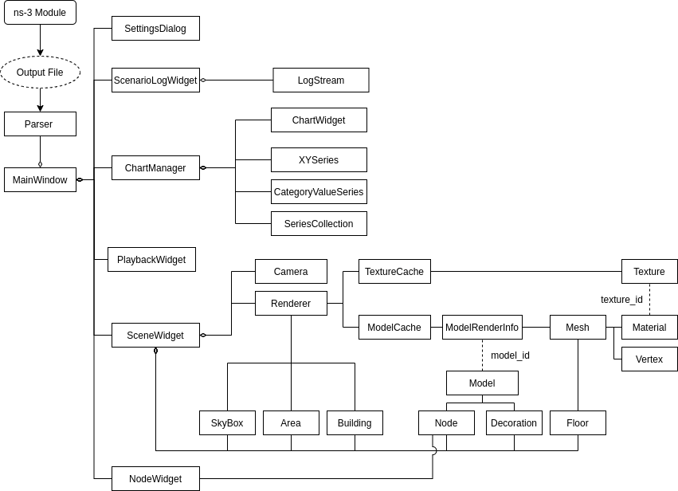
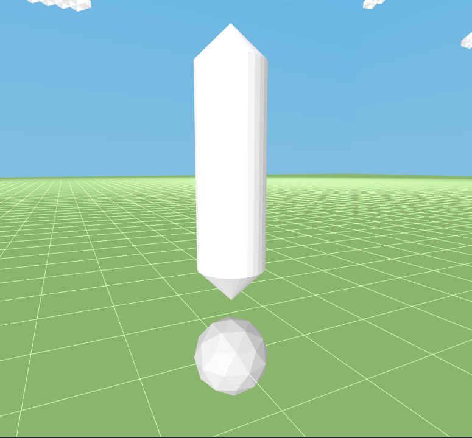

************
Architecture
************

Concepts
========

Time
----
While playback is not paused, the current time (tracked in the status bar and the Playback Controller)
moves forward every frame. The amount of time advanced per frame may be found in the settings under
'Time Step' and may optionally be set by the Output File.

The current time may be adjusted by moving the slider in the Playback Controller.

Events
------
The recorded changes in the scenario are referred to as events. Each
event tracks the time it occurred, any associated items, and the change
(e.g., Node 1 moved to 0,0,0 at 100ms).

Events are applied to items during playback at the time they occurred in the scenario.
If an event is stepped over by either having a 'Time Step' that is too high or seeking
past the event with the Playback Controller, the event will be applied to the
next possible frame.

Each component that manages items from the scenario, ``ScenarioLogWidget``, ``ChartManager``, and
``SceneWidget`` also manages the events for its items.

Window Components
=================

MainWindow
----------
The ``MainWindow`` creates all of the subcomponents and manages the
connections and events between these components.

Parser
------
The ``Parser`` reads the output file from the *ns-3* module
and parses each record into an applicable ``parser::`` model
(e.g. ``parser::Node``). These models are used to create
the application representations of these items.

The ``Parser`` also collects metadata about the scenario,
such as the furthest point in each direction and the
time of the last event.

SceneWidget
-----------
The ``SceneWidget`` renders the scenario topology along with any additional details
such as the floor and skybox, manages the OpenGL context, tracks the current
playback time and state, and connects user input to the ``Camera``.

.. TODO note events

PlaybackWidget
--------------
The ``PlaybackWidget`` allows for direct user control of the current time.
It informs the ``SceneWidget`` to any seeking and playback state changes (Play/Pause)
and reflects the current time and playback state visually.

NodeWidget
----------
The ``NodeWidget`` receives the ``Node`` s in the output file
from the ``MainWindow``. When one is activated, it signals the
``SceneWidget`` to move the ``Camera`` to the location of that ``Node``.

ChartManager
------------
The ``ChartManager`` receives all of the series from the ``MainWindow`` and
their associated events. It then creates the Qt components to render these charts
and associates them with the output file models. The list is
sorted based on the defined ``SortOrder``, and is provided to any spawned
``ChartWidgets``. The ``ChartManager`` also tracks which series
each ``ChartWidget`` is displaying and will only allow a
series to be displayed on one ``ChartWidget`` at a time.

The ``ChartManager`` also manages all series events. It receives a signal
that the time has changed from the ``SceneWidget`` and applies the events
in that period to its stored series.

LogWidget
---------
The ``LogWidget`` receives all of the ``LogStreams`` from the output file
and their associated events.

Rendering Components
====================

Vertex
------
The ``Vertex`` struct is the basic unit for most rendered 3D models. Every single point
on a loaded model has a ``Vertex`` defined for it, which defines its location, as well as
any location-dependent properties, such as texture coordinates.

Material
--------
A material defines characteristics of a single type of surface, such
as how reflective it is or what color or texture to use for it. The
``Material`` struct tracks these properties for displaying these differences.

Mesh
----
A mesh is a single render-able section of an overall 3D model.
A single 3D model may contain one or more meshes. The ``Mesh``
class tracks one of these meshes.

A ``Mesh`` may be thought of as an array of ``Vertex``es with
an associated ``Material``. Each ``Vertex`` has individually
configured attributes, and the ``Material`` defines additional
properties for the whole ``Mesh``.

ModelRenderInfo
---------------
A class that loads, tracks, and renders all of the ``Mesh`` es for a 3D model.
It contains only the information from the file this 3D model was loaded from.
Additional information is stored in the ``Model`` class

ModelCache
----------
The ``ModelCache`` stores and tracks every 3D model loaded into the application and
its corresponding ``ModelRenderInfo``.

Typically, a rendered scenario reuses at least one 3D model, so instead of duplicating all of the
data for that 3D model, it is stored as an instance of the ``Model`` class, which references the
actual ``ModelRenderInfo`` stored in this cache.

Model
-----
The ``Model`` class tracks configurable properties of a model rendered in the ``SceneWidget``,
such as position in the scene, orientation, and height. It contains a ``model_id`` which is an index
into the ``ModelCache``, which contains the actual 3D geometry used to render the model.

TextureCache
------------
Much like the ``ModelCache``, stores and tracks all of the textures loaded by the application.

Texture
-------
Much like ``Model``, the ``Texture`` struct contains an ID into the ``TextureCache``
as well as some metadata about the texture itself.

Fallback Resources
------------------
If a model or texture file fails to load, then both the ``ModelCache`` and ``TextureCache``
have a 'fallback' model or texture which is substituted for the resource that failed to
load.

Fallback Texture
^^^^^^^^^^^^^^^^

.. image:: _static/fallback-texture.png
  :alt: Model with the fallback texture loaded

Fallback Model
^^^^^^^^^^^^^^

Camera
------
The ``Camera`` adjusts what is currently visible based on its current location and
makes rendered items appear closer or further away based on its configured perspective.