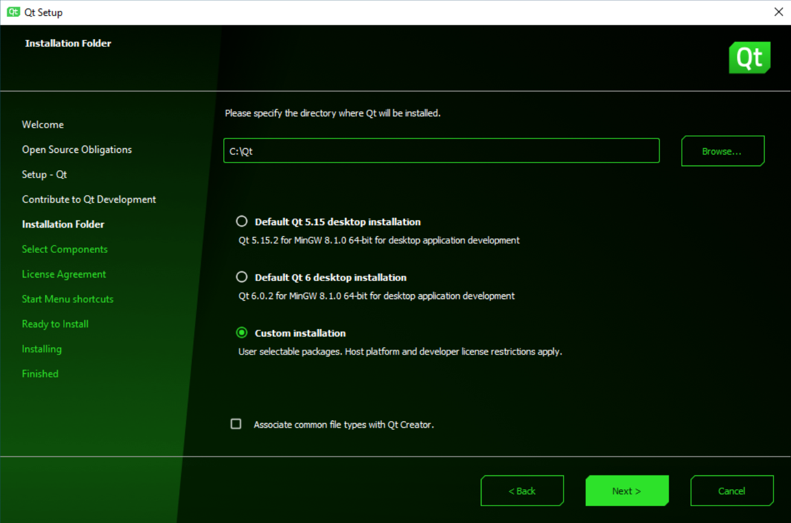
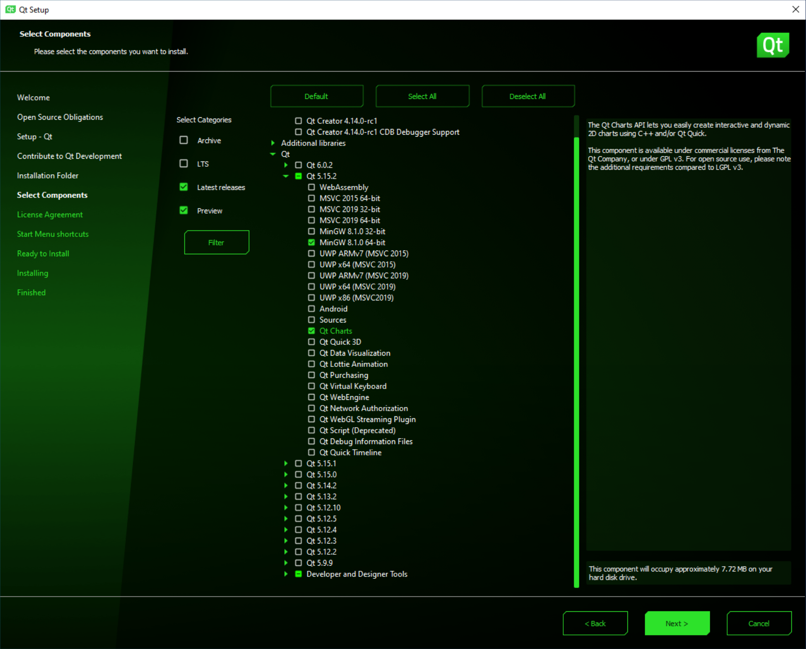
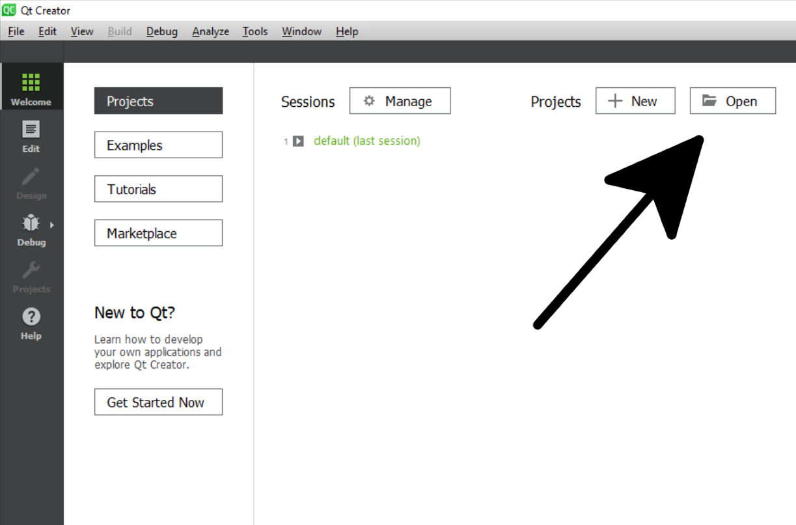
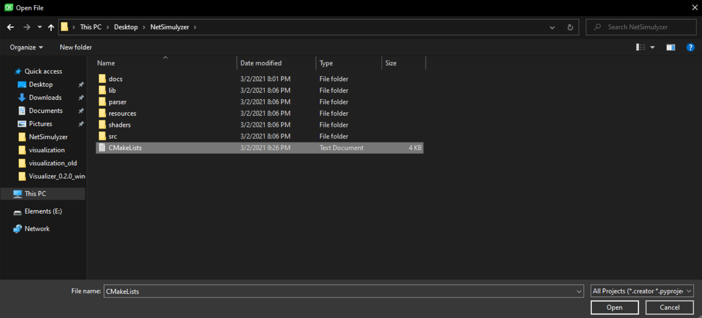
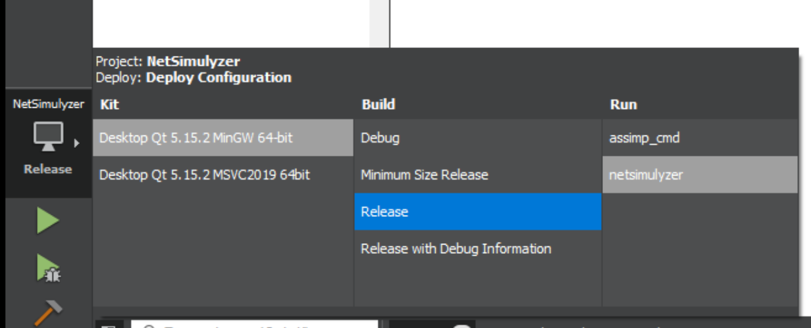
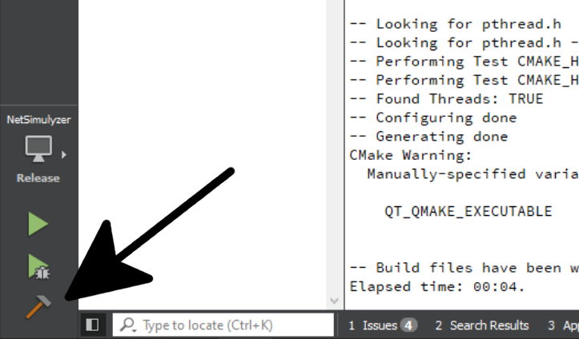
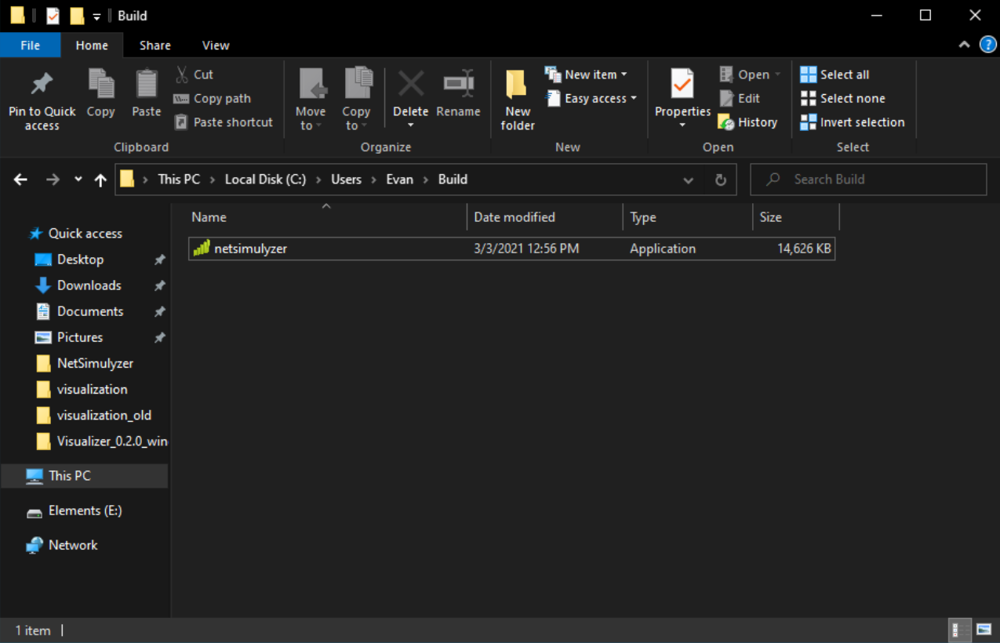
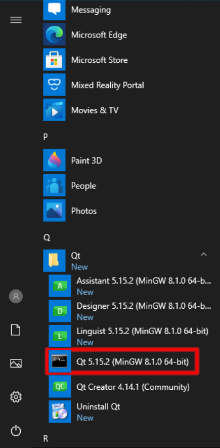
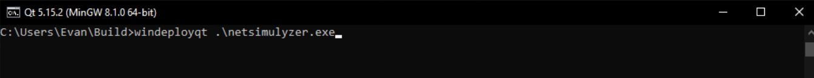
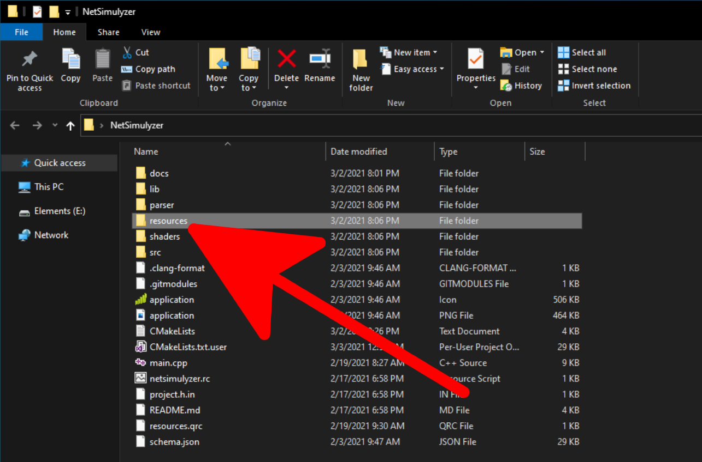

Building the Application
========================

Build Requirements
------------------
* A C++ 17 compliant compiler

  * Minimum supported compilers:

    * GCC 7.3.0
    * Clang 6.0.0

* CMake 3.13 or greater
* A graphics card supporting OpenGL 3.3

  * Most CPU based graphics should work as well
* Qt 5.12
* Optional: Doxygen

  * For building the documentation


Clone Project
-------------
In order to build the project, it must first be cloned recursively to get all of the necessary dependencies.

.. code-block:: Bash

  git clone --recursive https://github.com/usnistgov/NetSimulyzer.git

Note: If you already cloned the project the normal way
You may pull the dependencies by running

.. code-block:: Bash

  git submodule update --recursive


Building for Windows
--------------------

The recommended way to install the application on Windows is to
use a prebuild version hosted `on GitHub here <https://github.com/usnistgov/NetSimulyzer/releases>`_. However,
if building from source is necessary, then read on...


Install Qt Creator
^^^^^^^^^^^^^^^^^^
Download `Qt Creator from Qt's website <https://www.qt.io/download-qt-installer>`_

Run the installer
^^^^^^^^^^^^^^^^^
Run the installer and select 'Custom installation'




Choose at least Qt 5.12 with Charts, MinGW, & CMake.



Open Project
^^^^^^^^^^^^
Open Qt Creator & select 'Open'



Navigate to the project directory and select the 'CMakeLists.txt' file



If prompted, select the 'MinGW' kit

.. image:: _static/qt-open-kit-select.png
  :alt: Qt Creator Kit selection with the 'MinGW' kit selected


Configure Build
^^^^^^^^^^^^^^^
Open the menu above the Run, Debug, and Build buttons and make sure the
'MinGW' kit is selected, the build type is 'Release' and 'netsimulyzer' is the
run target



Run the Build
^^^^^^^^^^^^^
Press the build button, and Qt Creator will build the application.



Move the Built Application
^^^^^^^^^^^^^^^^^^^^^^^^^^
When the build is complete, move the compiled application to an empty directory.



Include Runtime Dependencies
^^^^^^^^^^^^^^^^^^^^^^^^^^^^
To add the additional files needed at runtime, use the `windeployqt <https://doc.qt.io/qt-5/windows-deployment.html>`_
tool.

Select the Qt 'MinQW' prompt from the Windows start menu



Navigate to the directory the built application was moved to and run ``windeployqt .\netsimulyzer.exe``



This will copy the runtime dependencies to the directory.

Copy the ``resources/`` directory from the project to the directory containing the
built application



.. _building-for-macos:

Building for macOS
------------------

Installing Qt
^^^^^^^^^^^^^

1)  Install QtCreator
    QtChars is needed but not installed by default. You can add module by running the Qt Maintenance tool (located in the Qt installation directory).
    Select "add/remove component", then expand the components for the Qt version installed on the system and add QtCharts.

2)  Set the environment variable
    for example ```CMAKE_PREFIX_PATH=/Users/rouil/Qt/5.15.0/clang_64/```.
    This is needed to build the application.


Building the Application
^^^^^^^^^^^^^^^^^^^^^^^^

.. code-block:: Bash

  git clone --recursive git@gitlab.nist.gov:wnd-publicsafety/visualization.git
  mkdir build
  cd build
  cmake -DCMAKE_BUILD_TYPE=Release ..
  cmake --build . --parallel

Note: Run ``cmake -DCMAKE_BUILD_TYPE=Debug ..`` to create a debug build.


Building for Linux
------------------

Install Qt
^^^^^^^^^^

Make sure Qt is available on your system. To install the following packages

Ubuntu: ``qt5-default libqt5charts5-dev``

Arch: ``qt5-base qt5-charts``

Setup Build Directory
^^^^^^^^^^^^^^^^^^^^^

Move into the project's root directory, and make a new directory called ``build`` and ``cd`` into it.

.. code-block:: Bash

  cd NetSimulyzer
  mkdir build
  cd build

Configure CMake
^^^^^^^^^^^^^^^

Run CMake and pass it the path to the project root. If you followed the step above,
then it should be just one level up. Also, specify that it is a release build to enable
optimizations.

.. code-block:: Bash

  cmake -DCMAKE_BUILD_TYPE=Release  ..

For more options to configure the build, see: :ref:`advanced-build-options`

Run the Build Tool
^^^^^^^^^^^^^^^^^^

Tell CMake to run the build tool, passing the path to the build directory and optionally
run the build with several threads with ``--parallel``

.. code-block:: Bash

  cmake --build . --parallel

If no errors occur, then the application was successfully built.

.. _advanced-build-options:

Advanced Build Options
----------------------

To configure the build, any of the below may be passed to CMake with ``-D`` in the form ``cmake -DNAME=VALUE``.

All of the following are optional.

* ``ENABLE_DOXYGEN``: Default ``False``, set to ``True`` to build the API docs to the ``doxygen/`` directory in the build directory
